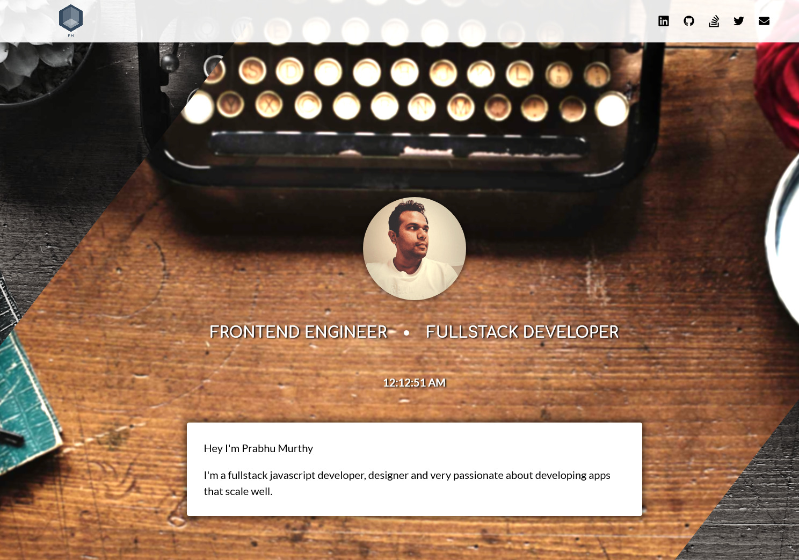

[](https://circleci.com/gh/prabhuignoto/myportfolio)
[](https://codecov.io/gh/prabhuignoto/myportfolio)
[](https://github.com/styled-components/styled-components)
[](https://github.com/facebook/jest)

## Modern frontend dev portfolio


### Installing

Clone the project locally and run the following command to install the dependencies first.

```javascript
npm install
```

### Development Mode

To start the project in development mode

```javascript
npm run develop
```

### Testing

```javascript
npm run test
```

### Deployment

To generate the production build, please run

```javascript
npm run build
```

### Built With

* [Gatsby JS](https://www.gatsbyjs.org/) - Static site generator for React.
* [React JS](https://reactjs.org/) - Library for creating user interfaces.
* [Styled Components](https://www.styled-components.com/) - Visual primitives for UI components.

* **Prabhu Murthy** - *Initial work* - [PrabhuIgnoto](https://github.com/prabhuignoto)

### License

This project is licensed under the MIT License - see the [LICENSE.md](LICENSE.md) file for details
